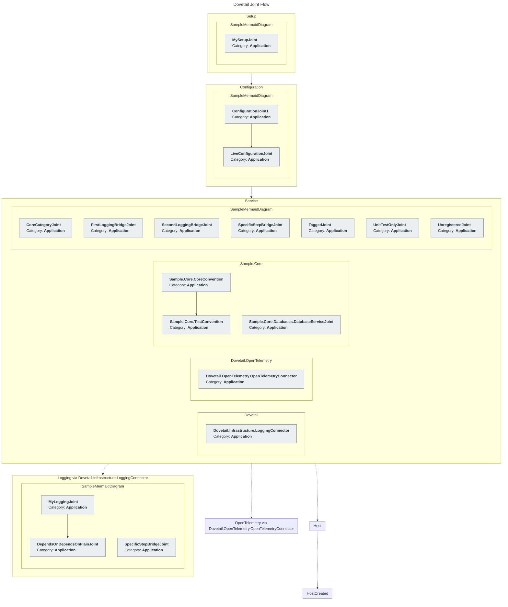

```mermaid
---
title: Dovetail Joint Flow
---
flowchart TB
    subgraph sub1 [Setup]
    direction RL
    subgraph sub2 [SampleMermaidDiagram]
    id3["`**MySetupJoint**<br/>Category: **Application**`"]
    end
    end
    subgraph sub6 [Configuration]
    direction RL
    subgraph sub7 [SampleMermaidDiagram]
    id8["`**ConfigurationJoint1**<br/>Category: **Application**`"]
    id9["`**LiveConfigurationJoint**<br/>Category: **Application**`"]
    end
    end
    subgraph sub12 [Service]
    direction RL
    subgraph sub13 [Dovetail]
    id14["`**Dovetail.Infrastructure.LoggingConnector**<br/>Category: **Application**`"]
    end
    subgraph sub16 [Dovetail.OpenTelemetry]
    id17["`**Dovetail.OpenTelemetry.OpenTelemetryConnector**<br/>Category: **Application**`"]
    end
    subgraph sub19 [Sample.Core]
    id20["`**Sample.Core.CoreConvention**<br/>Category: **Application**`"]
    id21["`**Sample.Core.Databases.DatabaseServiceJoint**<br/>Category: **Application**`"]
    id22["`**Sample.Core.TestConvention**<br/>Category: **Application**`"]
    end
    subgraph sub24 [SampleMermaidDiagram]
    id25["`**CoreCategoryJoint**<br/>Category: **Application**`"]
    id26["`**FirstLoggingBridgeJoint**<br/>Category: **Application**`"]
    id27["`**SecondLoggingBridgeJoint**<br/>Category: **Application**`"]
    id28["`**SpecificStepBridgeJoint**<br/>Category: **Application**`"]
    id29["`**TaggedJoint**<br/>Category: **Application**`"]
    id30["`**UnitTestOnlyJoint**<br/>Category: **Application**`"]
    id31["`**UnregisteredJoint**<br/>Category: **Application**`"]
    end
    end
    subgraph sub34 [Host]
    direction RL
    end
    subgraph sub36 [HostCreated]
    direction RL
    end
    subgraph sub38 [OpenTelemetry via Dovetail.OpenTelemetry.OpenTelemetryConnector]
    direction RL
    end
    subgraph sub40 [Logging via Dovetail.Infrastructure.LoggingConnector]
    direction RL
    subgraph sub41 [SampleMermaidDiagram]
    id42["`**MyLoggingJoint**<br/>Category: **Application**`"]
    id43["`**DependsOnDependsOnPlainJoint**<br/>Category: **Application**`"]
    id44["`**SpecificStepBridgeJoint**<br/>Category: **Application**`"]
    end
    end
    sub12 -.-> sub38
    sub12 -.-> sub40
    sub12 -.-> sub34
    sub34 -.-> sub36
    sub1 -.-> sub6
    sub6 -.-> sub12
    id20 --> id22
    id8 --> id9
    id42 --> id43
    classDef hostUndefined text-align:left,fill:#eceff1,stroke:#607d8b,color:#263238
    classDef hostLive text-align:left,fill:#c8e6c9,stroke:#2e7d32,color:#1b5e20
    classDef hostUnitTest text-align:left,fill:#ffe0b2,stroke:#ef6c00,color:#e65100
    classDef hostUndefined text-align:left,fill:#eceff1,stroke:#607d8b,color:#263238
    classDef hostLive text-align:left,fill:#c8e6c9,stroke:#2e7d32,color:#1b5e20
    classDef hostUnitTest text-align:left,fill:#ffe0b2,stroke:#ef6c00,color:#e65100
    classDef hostUndefined text-align:left,fill:#eceff1,stroke:#607d8b,color:#263238
    classDef hostLive text-align:left,fill:#c8e6c9,stroke:#2e7d32,color:#1b5e20
    classDef hostUnitTest text-align:left,fill:#ffe0b2,stroke:#ef6c00,color:#e65100
    classDef hostUndefined text-align:left,fill:#eceff1,stroke:#607d8b,color:#263238
    classDef hostLive text-align:left,fill:#c8e6c9,stroke:#2e7d32,color:#1b5e20
    classDef hostUnitTest text-align:left,fill:#ffe0b2,stroke:#ef6c00,color:#e65100
    classDef hostUndefined text-align:left,fill:#eceff1,stroke:#607d8b,color:#263238
    classDef hostLive text-align:left,fill:#c8e6c9,stroke:#2e7d32,color:#1b5e20
    classDef hostUnitTest text-align:left,fill:#ffe0b2,stroke:#ef6c00,color:#e65100
    classDef hostUndefined text-align:left,fill:#eceff1,stroke:#607d8b,color:#263238
    classDef hostLive text-align:left,fill:#c8e6c9,stroke:#2e7d32,color:#1b5e20
    classDef hostUnitTest text-align:left,fill:#ffe0b2,stroke:#ef6c00,color:#e65100
    classDef hostUndefined text-align:left,fill:#eceff1,stroke:#607d8b,color:#263238
    classDef hostLive text-align:left,fill:#c8e6c9,stroke:#2e7d32,color:#1b5e20
    classDef hostUnitTest text-align:left,fill:#ffe0b2,stroke:#ef6c00,color:#e65100
    classDef hostUndefined text-align:left,fill:#eceff1,stroke:#607d8b,color:#263238
    classDef hostLive text-align:left,fill:#c8e6c9,stroke:#2e7d32,color:#1b5e20
    classDef hostUnitTest text-align:left,fill:#ffe0b2,stroke:#ef6c00,color:#e65100
    classDef hostUndefined text-align:left,fill:#eceff1,stroke:#607d8b,color:#263238
    classDef hostLive text-align:left,fill:#c8e6c9,stroke:#2e7d32,color:#1b5e20
    classDef hostUnitTest text-align:left,fill:#ffe0b2,stroke:#ef6c00,color:#e65100
    classDef hostUndefined text-align:left,fill:#eceff1,stroke:#607d8b,color:#263238
    classDef hostLive text-align:left,fill:#c8e6c9,stroke:#2e7d32,color:#1b5e20
    classDef hostUnitTest text-align:left,fill:#ffe0b2,stroke:#ef6c00,color:#e65100
    classDef hostUndefined text-align:left,fill:#eceff1,stroke:#607d8b,color:#263238
    classDef hostLive text-align:left,fill:#c8e6c9,stroke:#2e7d32,color:#1b5e20
    classDef hostUnitTest text-align:left,fill:#ffe0b2,stroke:#ef6c00,color:#e65100
    classDef hostUndefined text-align:left,fill:#eceff1,stroke:#607d8b,color:#263238
    classDef hostLive text-align:left,fill:#c8e6c9,stroke:#2e7d32,color:#1b5e20
    classDef hostUnitTest text-align:left,fill:#ffe0b2,stroke:#ef6c00,color:#e65100
    classDef hostUndefined text-align:left,fill:#eceff1,stroke:#607d8b,color:#263238
    classDef hostLive text-align:left,fill:#c8e6c9,stroke:#2e7d32,color:#1b5e20
    classDef hostUnitTest text-align:left,fill:#ffe0b2,stroke:#ef6c00,color:#e65100
    classDef hostUndefined text-align:left,fill:#eceff1,stroke:#607d8b,color:#263238
    classDef hostLive text-align:left,fill:#c8e6c9,stroke:#2e7d32,color:#1b5e20
    classDef hostUnitTest text-align:left,fill:#ffe0b2,stroke:#ef6c00,color:#e65100
    classDef hostUndefined text-align:left,fill:#eceff1,stroke:#607d8b,color:#263238
    classDef hostLive text-align:left,fill:#c8e6c9,stroke:#2e7d32,color:#1b5e20
    classDef hostUnitTest text-align:left,fill:#ffe0b2,stroke:#ef6c00,color:#e65100
    classDef hostUndefined text-align:left,fill:#eceff1,stroke:#607d8b,color:#263238
    classDef hostLive text-align:left,fill:#c8e6c9,stroke:#2e7d32,color:#1b5e20
    classDef hostUnitTest text-align:left,fill:#ffe0b2,stroke:#ef6c00,color:#e65100
    classDef hostUndefined text-align:left,fill:#eceff1,stroke:#607d8b,color:#263238
    classDef hostLive text-align:left,fill:#c8e6c9,stroke:#2e7d32,color:#1b5e20
    classDef hostUnitTest text-align:left,fill:#ffe0b2,stroke:#ef6c00,color:#e65100
    classDef hostUndefined text-align:left,fill:#eceff1,stroke:#607d8b,color:#263238
    classDef hostLive text-align:left,fill:#c8e6c9,stroke:#2e7d32,color:#1b5e20
    classDef hostUnitTest text-align:left,fill:#ffe0b2,stroke:#ef6c00,color:#e65100
    class id3 hostUndefined
    class id8 hostUndefined
    class id9 hostUndefined
    class id14 hostUndefined
    class id17 hostUndefined
    class id20 hostUndefined
    class id21 hostUndefined
    class id22 hostUndefined
    class id25 hostUndefined
    class id26 hostUndefined
    class id27 hostUndefined
    class id28 hostUndefined
    class id29 hostUndefined
    class id30 hostUndefined
    class id31 hostUndefined
    class id42 hostUndefined
    class id43 hostUndefined
    class id44 hostUndefined
```
